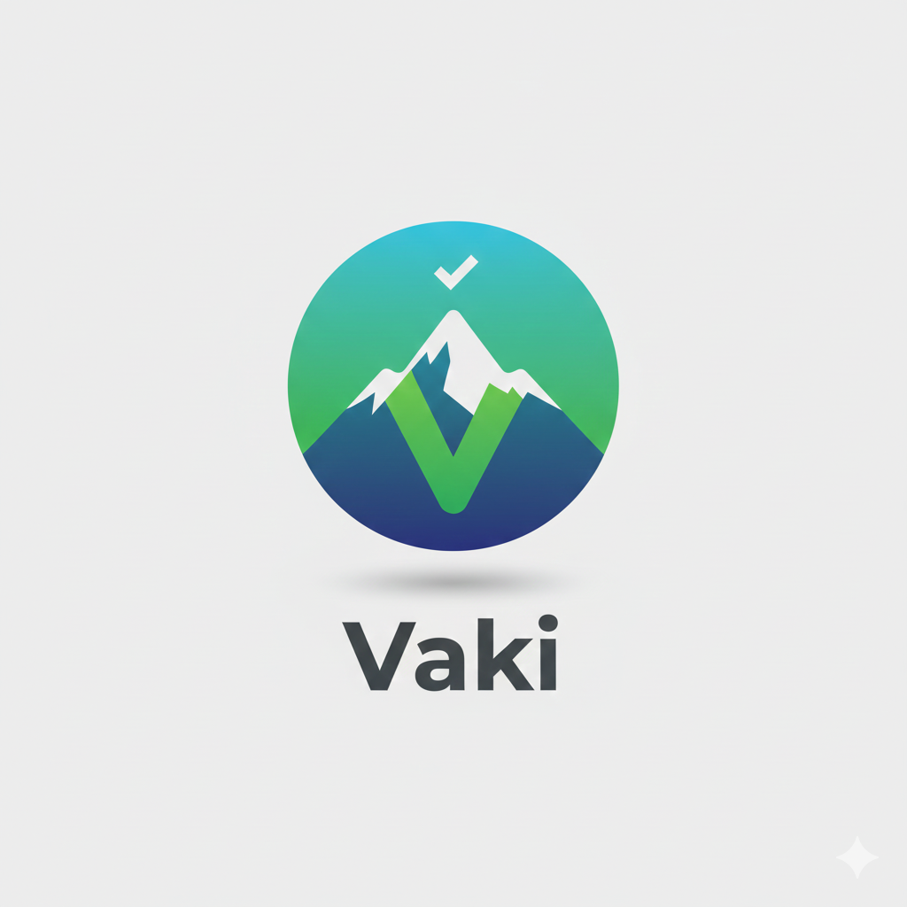
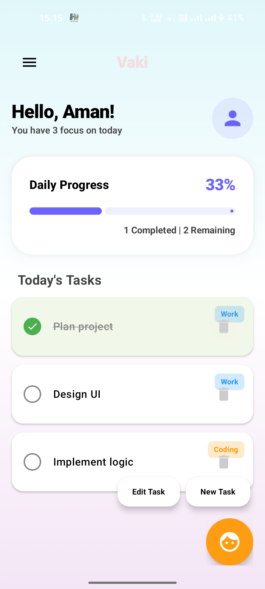

# Vaki - Premium Voice-Enabled Task Assistant 🚀

  

Vaki is a modern, high-performance Android productivity application that combines a premium Material 3 user interface with an advanced, hands-free voice assistant. Designed for users who value efficiency, Vaki allows you to manage your daily tasks through natural conversation and a visually stunning dashboard.

---

## ✨ Features

- **🎨 Premium UI/UX**: Soft gradients, glassmorphism-inspired cards, and high-contrast typography for a gorgeous look.
- **🎙️ Hands-Free Voice Assistant**: Add tasks naturally by speaking (e.g., *"Add task Finish UI design"*).
- **📝 Add Task**: Seamlessly manage your to-do list with both voice and manual input.
- **🔘 Animated Voice Button**: A fluid, expanding mic button that provides visual feedback when Vaki is listening.
- **🗺️ Navigation Drawer**: A smooth slide-out menu providing quick access to essential tools like **Set Alarm** and **Add Notes**.

---

## 🚀 Release History

### **v1.1 - The Hands-Free Update (Latest)**
- **Offline Wake-Word Detection**: Integrated Vosk SDK for "Hi Vaki" wake-word recognition.
- **Hands-Free Flow**: Automatically triggers greeting and starts listening for commands without touching the phone.
- **Improved Voice Handoff**: Seamless transition between offline wake-word detection and online high-accuracy speech recognition.
- **Bug Fixes**: Resolved crashes related to voice timeouts and improved error handling for "No Match" scenarios.

### **v1.0 - Initial Release**
- Core Premium UI/UX with high-contrast Material 3 components.
- Standard Voice Assistant integration (Greeting to Command flow).
- Animated Voice Button with expansion effects.
- Modern Navigation Drawer with quick access tools.

---

## 📸 App Interface

  

---

## 🚀 How to Use (Step-by-Step)

### 1. The Welcome Greeting
Upon opening the app, you'll be greeted by your personalized dashboard showing your current focus count and daily progress.

### 2. Triggering Vaki (Hands-Free)
Simply say **"Hi Vaki"** clearly. The Voice Button will expand automatically, and Vaki will say: *"Hello Aman, how can I help you today?"*

### 3. Manual Trigger
You can also click the **Mic (Face) Button** at any time to start a voice session manually.

### 4. Adding a Task
Wait for Vaki to finish her greeting, then say: **"Add task [Your Task Name]"**. 
Vaki will respond: *"Got it! I've added your task [Name]. Thank you!"* and the task will instantly appear in your list.

### 5. Handling Timeouts
If Vaki doesn't hear anything for a few seconds, she will proactively say: *"Sorry! I heard nothing. Thank you!"* and the button will shrink automatically to its circular shape.

---

## 🛠️ Technical Setup

**Built With:**
- **Language**: Kotlin 2.0+
- **UI Framework**: Jetpack Compose (Material 3)
- **Speech Engines**: `android.speech.RecognizerIntent` (Online) & `Vosk` (Offline Wake-Word)
- **Voice Engine**: `android.speech.tts.TextToSpeech`
- **Architecture**: MVVM with ViewModel and State Hoisting

---

## 📜 License

MIT License

Copyright (c) 2025 Aman

Permission is hereby granted, free of charge, to any person obtaining a copy
of this software and associated documentation files (the "Software"), to deal
in the Software without restriction, including without limitation the rights
to use, copy, modify, merge, publish, distribute, sublicense, and/or sell
copies of the Software, and to permit persons to whom the Software is
furnished to do so, subject to the following conditions:

The above copyright notice and this permission notice shall be included in all
copies or substantial portions of the Software.

THE SOFTWARE IS PROVIDED "AS IS", WITHOUT WARRANTY OF ANY KIND, EXPRESS OR
IMPLIED, INCLUDING BUT NOT LIMITED TO THE WARRANTIES OF MERCHANTABILITY,
FITNESS FOR A PARTICULAR PURPOSE AND NONINFRINGEMENT. IN NO EVENT SHALL THE
AUTHORS OR COPYRIGHT HOLDERS BE LIABLE FOR ANY CLAIM, DAMAGES OR OTHER
LIABILITY, WHETHER IN AN ACTION OF CONTRACT, TORT OR OTHERWISE, ARISING FROM,
OUT OF OR IN CONNECTION WITH THE SOFTWARE OR THE USE OR OTHER DEALINGS IN THE
SOFTWARE.
